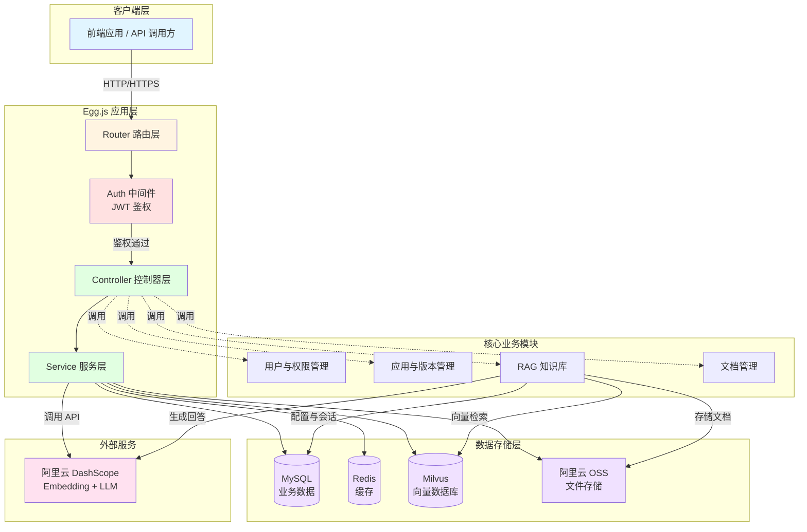

## 项目简介

本项目基于 **Egg.js** 搭建，是一个平台标准后端服务，集成了用户管理、权限控制、文件上传以及 RAG（检索增强生成）知识库问答能力，支持在 **Devbox** 环境中区分开发和生产环境部署。项目的代码与数据全部托管在云端，通过 Devbox 提供的远程开发容器运行，结合 Cursor 开发工具进行在线协作与迭代，无需本地安装数据库或 Milvus 环境。

相比传统“本地环境 + 远程服务器”的开发模式，基于 Devbox 的云端开发方式具有以下优势：
- **环境统一、零配置成本**：所有依赖（Node.js、MySQL、Redis、Milvus 等）预先在 Devbox 中配置好，新成员只需拉起环境即可开发，避免“我这能跑、你那跑不起来”的问题。
- **代码与数据集中管理**：后端代码、数据库与向量库统一运行在云端，既便于备份与运维，也方便在多终端（本机 / 云桌面）之间切换开发。
- **适合小团队的敏捷迭代**：小团队无需自建复杂的 DevOps 基础设施，就能获得接近“云 IDE + 一体化后端环境”的体验，降低环境维护成本，把更多精力放在业务与产品功能上。
- **对比 VSCode Live Share 的优势**：Live Share 更偏向“编辑会话共享”，依赖每个开发者本地已有完整环境；Devbox 则是把**整个运行环境（代码 + 数据库 + 向量库 + 依赖）上云**，团队成员共享同一套真实服务环境，更适合需要快速拉起后端/数据库/Milvus 等复杂依赖的小型团队项目，而不是仅仅共享代码编辑界面。

主要特性：
- **统一鉴权与权限控制**：基于 JWT 的认证机制，`auth` 中间件统一写入 `ctx.auth`，结合 `PermissionUtil` 做细粒度权限控制（含超级管理员）。
- **多数据库支持**：使用 `egg-mysql` 直连业务库（如 `plat_users`、`mobile_app`），同时保留 Sequelize 以支持更多数据库类型。
- **阿里云 OSS 文件上传**：提供头像等文件上传能力，统一封装在 OSS 服务配置中。
- **RAG 知识库问答**：集成 Milvus 2.4.x 作为向量数据库，结合阿里云 DashScope Embedding + LLM，实现企业知识库的问答与会话记忆。
- **前端管理端**：采用 **Vben Admin** 作为前端管理框架，提供统一的后台管理界面（应用管理、版本管理、RAG 配置与会话查看等），与本项目的后端 API 进行集成。
- **API 文档站点**：在 `app/public/docs` 下提供基于 Vue 的静态接口文档页面，包含用户、权限矩阵、RAG 接口等模块。

## 功能设计概述

### 项目架构图



**架构说明**：
- **客户端层**：前端应用或 API 调用方通过 HTTP/HTTPS 访问后端接口。
- **Egg.js 应用层**：
  - **Router**：路由分发，将请求映射到对应的 Controller。
  - **Auth 中间件**：全局 JWT 鉴权，校验 Token 并将用户信息挂载到 `ctx.auth`。
  - **Controller**：处理请求参数校验、调用 Service、返回响应。
  - **Service**：业务逻辑封装，操作数据库、调用外部服务。
- **数据存储层**：
  - **MySQL**：存储业务数据（用户、应用、RAG 配置、会话、消息等）。
  - **Redis**：缓存层，提升查询性能。
  - **Milvus**：向量数据库，存储文档分块的向量表示，用于相似度检索。
  - **阿里云 OSS**：对象存储，存放上传的文件（如头像、知识库文档）。
- **外部服务**：
  - **阿里云 DashScope**：提供 Embedding 模型（文本向量化）和 LLM 模型（生成回答）。
- **核心业务模块**：用户权限、应用版本、RAG 知识库、文档管理等业务功能。

### 用户与权限
- 通过登录接口获取 `token` 和 `refreshToken`，后续请求在 `Authorization: Bearer <token>` 中传递。
- 全局 `auth` 中间件负责：
  - 校验 JWT，有效则将 `{ userId, username, userLev }` 挂载到 `ctx.auth`。
  - 非白名单接口自动鉴权，失败直接返回 401。
- 权限工具 `PermissionUtil`：
  - `isSuperAdmin(userLev)`：判断是否为超级管理员。
  - `requireSuperAdmin(ctx, message)`：在控制器中快速拦截仅管理员可执行的操作。
  - 会话管理、RAG 历史记录等接口中用来区分“管理员可看所有 / 普通用户仅能看自己”的数据边界。

### 应用与版本管理、日志管理

- **应用信息管理**
  - 以 `mobile_app` 表为核心，维护平台内各业务应用的基础信息（应用名称、编码、所属产品线、负责人等）。
  - 后续所有 RAG 配置、会话数据、知识库文档都以 `APP_ID` 作为业务维度进行隔离和统计。
  - 通过对应的应用管理接口（在文档站点中有专门模块）完成应用的创建、编辑、启停用、删除等操作。

- **版本管理（应用版本 / 客户端版本）**
  - 针对移动客户端 / 前端应用，提供版本信息的登记与查询能力，用于：
    - 记录各渠道（如 Android、iOS）的版本号、下载地址、更新说明。
    - 支持在接口层基于版本号做灰度、兼容性判断（例如老版本是否支持某些新接口）。
  - 版本信息与应用信息（`APP_ID`）绑定，可在文档中查看“某个应用下的全部版本历史”。

- **日志管理与审计**
  - 依托 Egg.js 自带的日志体系，区分应用日志和核心日志（`logger` / `coreLogger`），并在不同环境（local/prod）配置不同级别。
  - 对关键业务行为（如登录、RAG 问答、会话删除、配置变更）提供结构化日志，便于在 Devbox 上统一收集与排查。
  - 结合 `rag_question` / `rag_session_message` 等表，可以从数据库维度审计：
    - 某个会话 / 某个应用下的全部问答记录。
    - 检索耗时、Token 消耗、相似度等指标，为后续优化提供数据基础。

### RAG 知识库功能

- **文档管理**
  - 表：`rag_document` / `rag_document_chunk`
  - 支持上传 PDF、DOCX、MD、TXT 等文档，解析后按分块规则写入向量库。
  - 通过 `MILVUS_COLLECTION` 字段将文档与具体的 Milvus Collection 绑定。

- **RAG 配置管理**
  - 表：`rag_config`
  - 以 `APP_ID` 为维度存储每个应用的向量检索与模型配置，例如：
    - Milvus 集合名、向量维度
    - Embedding 模型、LLM 模型
    - LLM 参数（temperature、maxTokens、topP）
    - 检索参数（topK、similarityThreshold、indexType/indexParams）
    - 文本分段参数（chunkMaxLength、chunkOverlap、chunkSeparators）
    - Rerank 开关和模型
  - 通过接口：`GET/PUT/DELETE /api/rag/config/:appId` 管理配置。

- **会话与消息（RAG Memory）**
  - 会话表：`rag_session`
  - 会话消息表：`rag_session_message`
  - 设计思路：
    - 前端先调用 `POST /api/rag/sessions/:appId` 创建会话，获取 `sessionId`。
    - 随后所有问答均携带该 `sessionId` 调用 `POST /api/rag/ask/:appId`。
    - 每次问答会在 `rag_session_message` 中记录一条 user 消息和一条 assistant 消息。
  - 记忆能力：
    - `ragSessionService.getSessionHistory(sessionId, maxRounds)` 读取最近若干轮对话。
    - 将历史对话格式化后拼入 LLM Prompt，使同一会话内的问题能够关联前文上下文。

- **RAG 问答流程**
  1. 根据 `appId` 读取 `rag_config`，初始化 Embedding 和 Milvus Collection（`ragService.initRAGComponents`）。
  2. 对用户问题做 Embedding，通过 Milvus 搜索相似文本分块（`milvusVectorStore.similaritySearch`）。
  3. 根据 `similarityThreshold` 过滤结果，组装 `context` 文本。
  4. 读取会话历史消息，构造系统提示词 + 历史对话 + 当前问题的完整 Prompt。
  5. 调用 DashScope LLM（支持流式和非流式）生成回答。
  6. 将提问与回答、检索到的文档、Token 消耗等信息落表，用于后续审计与复盘。

### RAG 系统 Prompt 设计要点

- 引导模型：
  - 在文档 **部分相关** 时，尽量利用已有内容做推理和补充，不要轻易回答“文档中未找到相关信息”。
  - 区分“基于文档的结论”和“基于通用常识的建议”，避免把猜测描述成文档内容。
  - 鼓励使用列表、步骤等结构化方式输出，提升可读性。
- 在 `templates/rag-system-prompt.md` 中集中维护，便于统一调整风格与行为。

## RAG 相关数据表概览

核心表（都在 `database/rag_tables.sql` 中定义）：
- `rag_document`：文档主表，记录上传文件及处理状态。
- `rag_document_chunk`：文档分块表，存储切分后的文本片段及对应的 Milvus 向量 ID。
- `rag_config`：按 `APP_ID` 维度的 RAG 配置表。
- `rag_session`：会话表，每个会话对应多轮问答。
- `rag_session_message`：会话消息表，记录 user 与 assistant 的每条消息内容。
- `rag_question`：旧版“单轮问答记录表”，保留兼容与统计用途。

## Devbox 部署说明

本项目在 Devbox 上通过 **环境变量 + 表空间/实例区分** 实现开发 / 生产环境的隔离。

### 1. 环境变量总览

关键环境变量（以 Devbox 为例）：

- **MySQL**
  - `MYSQL_HOST` / `MYSQL_PORT`
  - `MYSQL_USER` / `MYSQL_PASSWORD`
  - `MYSQL_DATABASE`（开发：`egg_minimal`；生产：`egg_minimal_prod`）
- **Redis**
  - `REDIS_HOST` / `REDIS_PORT`
  - `REDIS_USERNAME` / `REDIS_PASSWORD`
  - `REDIS_DB`（开发可用 `0`，生产可用 `1`）
- **OSS（阿里云对象存储）**
  - `OSS_REGION`
  - `OSS_ACCESS_KEY_ID`
  - `OSS_ACCESS_KEY_SECRET`
  - `OSS_BUCKET`
  - `OSS_ENDPOINT`（可选）
- **Milvus 向量数据库**
  - `MILVUS_ADDRESS`（如：`dbconn.sealoshzh.site:49174`）
  - `MILVUS_USERNAME` / `MILVUS_PASSWORD`（如未开启认证可为空）
- **DashScope（通义千问）**
  - `DASHSCOPE_API_KEY`（必需）
  - 可选：`DASHSCOPE_EMBEDDING_MODEL`、`DASHSCOPE_EMBEDDING_DIMENSION`、`DASHSCOPE_BASE_URL`
  - 可选：`DASHSCOPE_LLM_BASE_URL`、`DASHSCOPE_LLM_ENDPOINT`
- **JWT**
  - `JWT_SECRET`（建议在生产环境设置为强随机值）

### 2. 开发环境（Dev 环境）部署

典型做法：

1. 在 Devbox 中创建开发用数据库与 Redis：
   - MySQL 数据库：`egg_minimal`
   - Redis 使用 DB `0`
2. 配置环境变量（示例）：

```bash
# MySQL（开发）
export MYSQL_HOST=dbconn.sealoshzh.site
export MYSQL_PORT=42548
export MYSQL_USER=root
export MYSQL_PASSWORD=xxxxxxx
export MYSQL_DATABASE=egg_minimal

# Redis（开发）
export REDIS_HOST=dbconn.sealoshzh.site
export REDIS_PORT=30725
export REDIS_USERNAME=default
export REDIS_PASSWORD=xxxxxxx
export REDIS_DB=0

# Milvus（开发）
export MILVUS_ADDRESS=dbconn.sealoshzh.site:49174

# DashScope（开发 & 生产可共用一个 key，视安全策略而定）
export DASHSCOPE_API_KEY=sk-xxxxxxxxxxxxxxxx

# OSS（通常开发/生产共用一个 Bucket，但前缀/目录区分）
export OSS_REGION=oss-cn-hangzhou
export OSS_ACCESS_KEY_ID=xxxxxx
export OSS_ACCESS_KEY_SECRET=xxxxxx
export OSS_BUCKET=platform-standard
export OSS_ENDPOINT=

# JWT
export JWT_SECRET=dev_jwt_secret_please_change
```

3. 初始化数据库：
   - 执行 `database/init.sql` 创建基础表（如 `plat_users`、`mobile_app`）。
   - 执行 `database/rag_tables.sql` 创建 RAG 相关表。

4. 启动服务：

```bash
npm install
npm run dev
# 默认监听 http://127.0.0.1:7001
```

5. 访问接口文档（本地）：
   - 浏览器打开：`http://127.0.0.1:7001/public/docs/index.html`

### 3. 生产环境（Prod 环境）部署

在 Devbox 上区分生产环境的推荐方式：

1. **MySQL 通过表空间区分**
   - 开发库：`egg_minimal`
   - 生产库：`egg_minimal_prod`
   - 可以使用 `CREATE TABLE egg_minimal_prod.xxx LIKE egg_minimal.xxx` 复制结构，再按需导入数据。

2. **Milvus 实例隔离（推荐）**
   - 开发与生产使用不同的 Milvus 实例或不同端口：
     - 开发：`MILVUS_ADDRESS=dbconn.sealoshzh.site:49174`
     - 生产：`MILVUS_ADDRESS=dbconn.sealoshzh.site:49175`（或另一台机器）
   - 这样在向量层面完全隔离，避免测试数据污染生产。

3. **环境变量（生产示例）**

```bash
# MySQL（生产）
export MYSQL_HOST=dbconn.sealoshzh.site
export MYSQL_PORT=42548
export MYSQL_USER=root
export MYSQL_PASSWORD=xxxxxxx
export MYSQL_DATABASE=egg_minimal_prod

# Redis（生产，使用 DB 1）
export REDIS_HOST=dbconn.sealoshzh.site
export REDIS_PORT=30725
export REDIS_USERNAME=default
export REDIS_PASSWORD=xxxxxxx
export REDIS_DB=1

# Milvus（生产，独立实例）
export MILVUS_ADDRESS=dbconn.sealoshzh.site:36757

# DashScope（可使用单独的生产 key）
export DASHSCOPE_API_KEY=sk-xxxxxxxxxxxxxxxx_prod

# OSS（通常与开发一致，但注意访问控制）
export OSS_REGION=oss-cn-hangzhou
export OSS_ACCESS_KEY_ID=xxxxxx
export OSS_ACCESS_KEY_SECRET=xxxxxx
export OSS_BUCKET=platform-standard
export OSS_ENDPOINT=

# JWT（生产必须为强随机 secret）
export JWT_SECRET=prod_jwt_secret_very_strong_and_random
```

4. 生产模式启动：

```bash
# 设置 NODE_ENV=production
export NODE_ENV=production

npm install --production
npm start
```

5. 数据库与 RAG 表初始化：
   - 在 `egg_minimal_prod` 中执行：
     - `database/init.sql`
     - `database/rag_tables.sql`

### 4. 开发 / 生产环境差异小结

- **MySQL**：同一实例，不同数据库（`egg_minimal` vs `egg_minimal_prod`）。
- **Redis**：可复用实例，通过 `REDIS_DB` 区分（如 0 vs 1）。
- **Milvus**：推荐使用不同实例或不同端口区分。
- **DashScope**：可共用，也可为生产单独申请一组 Key。
- **JWT Secret**：生产环境必须使用强随机值，不与开发共用。

## 参考文档

- `README.md`：原始 Egg 最小项目说明与通用开发指南。
- `database/init.sql`：基础业务库表结构。
- `database/rag_tables.sql`：RAG 相关表结构定义。
- `app/public/docs/index.html`：前端接口文档入口。
- `app/public/docs/src/modules/sections/RagModule.js`：RAG 接口文档模块。


